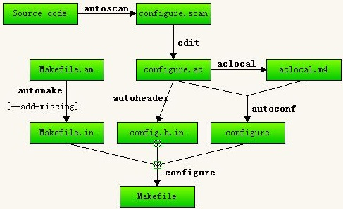

# autotools 项目创建



autoscan: 扫描源代码以搜寻普通的可移植性问题，比如检查编译器，库，头文件等，生成文件configure.scan,它是configure.ac的一个雏形。

aclocal:根据已经安装的宏，用户定义宏和acinclude.m4文件中的宏将configure.ac文件所需要的宏集中定义到文件 aclocal.m4中。aclocal是一个perl 脚本程序，它的定义是：“aclocal - create aclocal.m4 by scanning configure.ac”

automake:将Makefile.am中定义的结构建立Makefile.in，然后configure脚本将生成的Makefile.in文件转换 为Makefile。如果在configure.ac中定义了一些特殊的宏，比如AC_PROG_LIBTOOL，它会调用libtoolize，否则它 会自己产生config.guess和config.sub

autoconf:将configure.ac中的宏展开，生成configure脚本。这个过程可能要用到aclocal.m4中定义的宏。

automake包括:aclocal、automake等

autoconf包括：autoscan、autoconf等


## 操作步骤

### autoscan

在项目目录下执行 `autoscan` 命令生成 ` configure.scan`文件

### aclocal

```shell
mv configure.scan configure.ac

cat configure.ac # 修改文件
AC_PREREQ([2.69])
AC_INIT(hello, 0.1, admin@163.com)
AM_INIT_AUTOMAKE(hello, 1.0)
AC_CONFIG_SRCDIR([main.c])
AC_CONFIG_HEADERS([config.h])

# Checks for programs.
AC_PROG_CC

# Checks for libraries.

# Checks for header files.

# Checks for typedefs, structures, and compiler characteristics.

# Checks for library functions.

AC_OUTPUT(Makefile)

```


 **AC_PREREQ** 宏声明本文件要求的autoconf版本，本例使用的版本为2.59。
**· AC_INIT** 宏用来定义软件的名称和版本等信息，”FULL-PACKAGE-NAME”为软件包名称，”VERSION”为软件版本号，”BUG-REPORT-ADDRESS”为BUG报告地址（一般为软件作者邮件地址）。
**·AC_CONFIG_SRCDIR** 宏用来侦测所指定的源码文件是否存在，来确定源码目录的有效性。此处为当前目录下的hello.c。
**·AC_CONFIG_HEADER** 宏用于生成config.h文件，以便autoheader使用。
**·AC_PROG_CC** 用来指定编译器，如果不指定，选用默认gcc。
**·AC_OUTPUT** 用来设定 configure 所要产生的文件，如果是makefile，configure会把它检查出来的结果带入makefile.in文件产生合适的makefile。使用Automake时，还需要一些其他的参数，这些额外的宏用aclocal工具产生。

### autoconf

此时可以看到已经生成了configure

###  autoheader

autoheader生成了configure.h.in如果在configure.ac中定义了AC_CONFIG_HEADER，那么此文件就需要

### Makefile.am


```
touch Makefile.am # 创建配置文件
cat Makefile.am  #修改配置文件
AUTOMAKE_OPTIONS=foreign 
bin_PROGRAMS=hello 
hello_SOURCES=main.c
```

### automake

```
automake --add-missing
```

## 测试

```
./configure
make
./hello
```

## 打包

```
make dist
```

## 参考链接

[1]. [Linux下使用automake、autoconf生成configure文件](https://www.cnblogs.com/bugutian/p/5560548.html)

[2]. [configure、 make、 make install 背后的原理(翻译)](https://juejin.im/post/5d51845551882525d374ea34)

[3]. [configure和make install背后的故事](https://azyet.github.io/2015/06/20/configureAndMakeInstall/)

[4]. [cmake与autoconf+automake的对比](https://blog.csdn.net/cnsword/article/details/7542696)

